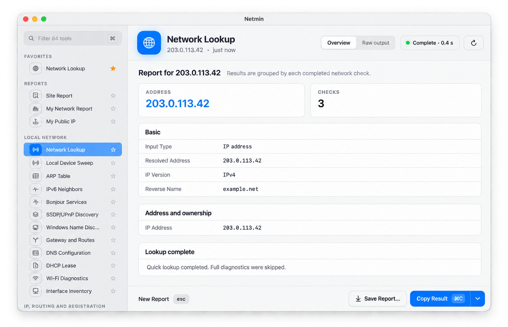
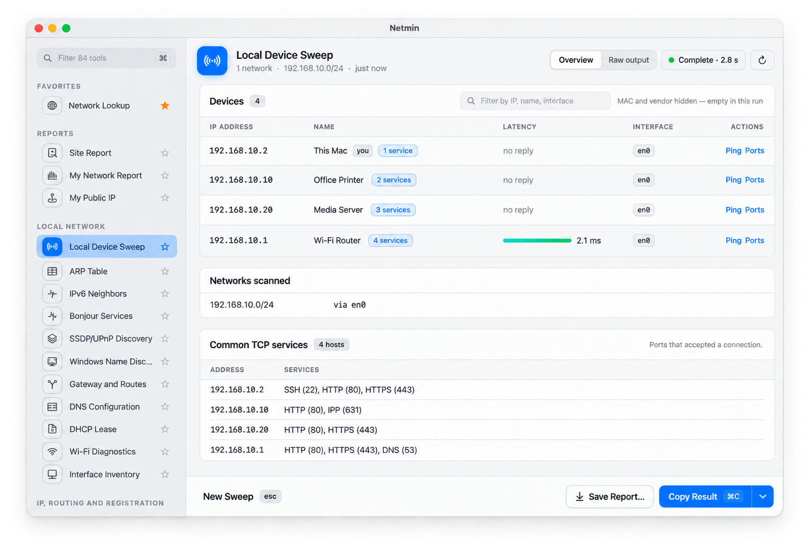

  

<h1 align="center">Netmin</h1>

<strong>Network answers without the terminal.</strong>

  Inspect DNS, routing, local devices, mail, TLS, websites, and ports from one native Mac app. Run a focused check or a complete report, follow it live, and keep the readable overview beside the raw evidence.

  <a href="https://min.tools/netmin">Website</a>&nbsp;&nbsp;|&nbsp;&nbsp;
  <a href="https://min.tools/netmin/support/">Support</a>&nbsp;&nbsp;|&nbsp;&nbsp;
  <a href="PRIVACY.md">Privacy</a>&nbsp;&nbsp;|&nbsp;&nbsp;
  <a href="docs/development.md">Build</a>&nbsp;&nbsp;|&nbsp;&nbsp;
  <a href="docs/architecture.md">Architecture</a>

  
  
  
  
  
  
  
  

  <picture>
    <source media="(prefers-color-scheme: dark)" srcset="docs/images/hero-dark.png">
    
  </picture>

- **Eighty-four tools in one place**  
  Work with reports, local discovery, IP and routing, DNS and DNSSEC, mail, TLS, websites, ports, and practical network utilities.
- **Readable results with the evidence nearby**  
  Review structured tables, metrics, findings, and device lists, then switch to the complete raw output when you need it.
- **Built for active diagnostics**  
  Watch output while a check runs, cancel safely, rerun it, copy the result, or save a plain-text report.
- **Local-network discovery**  
  Find devices and advertised services, inspect routes and interfaces, and choose exactly which detected networks to scan.
- **Checks input before running**  
  Netmin recognizes domains, IP addresses, CIDR ranges, URLs, MAC addresses, and optional DNS resolvers before it starts.
- **Bounded execution**  
  Fixed command templates, restricted environments, per-tool time limits, and an output cap keep a failed check under control.
- **No extra runtimes**  
  Netmin uses macOS system tools and its bundled helpers. It does not need Homebrew, Python, Perl, or another developer runtime.
- **Native and localized**  
  The interface follows macOS appearance, contrast, and accent settings and is available in twenty-seven languages.

## Get started

1. Open Netmin and choose a tool from the sidebar, or press **⌘K**.
2. Enter a target when the tool needs one.
3. Press **⌘Return** to run it.
4. Use **⌘1** for the overview and **⌘2** for raw output.

> [!NOTE]
> Netmin needs an Apple-silicon Mac running macOS 14 or later. Some checks contact the target or a named public lookup service and require network access. Local discovery also needs macOS Local Network permission.

## What Netmin checks

| Group | Examples |
| --- | --- |
| **Reports** | Network Lookup, Site Report, My Network Report, and public IP |
| **Local Network** | Device sweep, Bonjour, SSDP/UPnP, neighbors, routes, DHCP, Wi-Fi, and interfaces |
| **IP, Routing, and Registration** | IP information, RDAP, WHOIS, ASN/BGP, RPKI, reverse DNS, ping, and traceroute |
| **DNS** | Record queries, propagation, DNS over HTTPS, DNSSEC, DANE, trace, and zone discovery |
| **Mail** | MX, SPF, DMARC, DKIM, BIMI, MTA-STS, TLS reporting, service discovery, and STARTTLS |
| **TLS, Web, and Ports** | Certificates, protocol handshakes, HTTP headers, security.txt, HSTS, CT, SSH keys, and port checks |
| **Utilities** | CIDR calculation, range expansion, punycode, MAC formatting, NTP offset, and Network Quality |

The catalog is data-driven, so every tool has a defined target type, command, timeout, and result presentation.

## Reports you can use

The overview turns command output into cards, tables, metrics, and clear findings. **Raw output** keeps the full command response beside it for verification and troubleshooting. You can copy either form or save the report as a text file.

Live output appears while a check runs. Cancellation stops the active process, timeouts are reported clearly, and recent targets make repeated work quicker.

## Discover the local network

Local Device Sweep finds attached networks first and lets you choose which ranges to scan. Its result groups discovered devices, response times, interfaces, and common services without hiding the scanned ranges or raw evidence.

  <picture>
    <source media="(prefers-color-scheme: dark)" srcset="docs/images/sweep-dark.png">
    
  </picture>

Netmin also includes Bonjour, SSDP/UPnP, ARP, IPv6 neighbor, route, Wi-Fi, DHCP, and interface tools. Local checks run only after you start them and remain available independently from remote diagnostics.

## Controlled execution

Netmin launches only fixed command templates and bundled shell helpers. Inputs are validated before interpolation. Each run has its own timeout and an 8 MiB combined-output limit, and Local Device Sweep scans selected ranges sequentially.

The app is sandboxed. It does not execute arbitrary commands, ask for administrator access, or depend on tools installed by a package manager.

## Private by design

Netmin has no advertising, analytics, account system, or developer-operated diagnostic service. A check starts only when you choose a tool and run it. Requests go directly to the target, resolver, registry, or named public lookup provider needed for that check.

Up to eight recent targets remain in the app container until you clear them. Complete diagnostic output stays in memory unless you copy or export it. Read [Privacy](PRIVACY.md) for the services each tool may contact and the data they receive.

## One app, two ways to use it

**Mac App Store:** The free download starts with 30 days of unrestricted access. No subscription starts, and there is no charge. After the trial, every tool and its raw output remain available, with up to five new diagnostic requests per day. Pro removes the daily limit and restores structured reports, report export, and structured-result copying. Choose a yearly subscription or lifetime purchase at any time.

**Build from source:** This repository contains the public app source. Public source builds use the same trial, daily limit, StoreKit checks, and post-trial banner as the App Store app. See [Build and test](docs/development.md).

If Netmin helps you, [contribute](CONTRIBUTING.md) to its development.

## Documentation

| Guide | What it covers |
| --- | --- |
| [Build and test](docs/development.md) | Requirements, public build configurations, source exports, and tests |
| [Architecture](docs/architecture.md) | Build, execution, data, localization, and appearance boundaries |
| [Privacy](PRIVACY.md) | Local data, network requests, named services, retention, and controls |

## License

Copyright 2026 [Ilia Ross](https://github.com/iliaross). The source is available under the [PolyForm Strict License 1.0.0 with added permissions for personal modification and contributions](LICENSE). You may inspect, build, and run it for noncommercial purposes, modify it for your own personal, noncommercial use, and prepare a contribution to the official repository under the [contribution terms](CONTRIBUTING.md). The repository license does not otherwise permit distributing the source, modified copies, or binaries. The Min Tools name, the Netmin name, and the Netmin icon are not licensed. The Mac App Store build follows Apple's [standard EULA](https://www.apple.com/legal/internet-services/itunes/dev/stdeula/).
